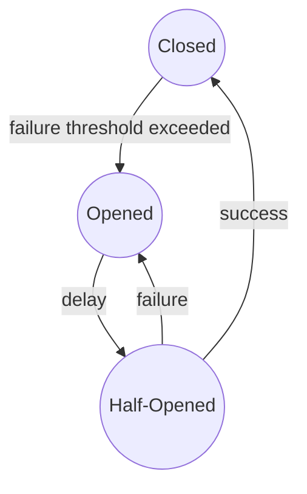

## Cicruit Breaker

The implementation of circuit breaker pattern uses for fault protection of microservice.

It monitors calls to third-party services and disables calls when it detects a large number of failed calls.

---

### Theory

This pattern based on three conditions: **closed**, **opened** and **half-opened**.

* **Closed** state - all requests to the target are executed normally
* **Opened** state - all requests to the target are blocked
* **Half-Opened** state - transitional state in which the circuit breaker partially sends requests
